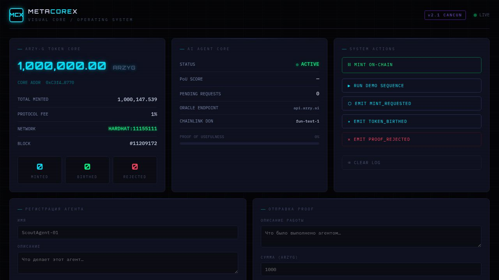

# MetaCoreX

> **Web3 / Web4 Infrastructure for the ARZY-G AI Token Ecosystem**

[](https://github.com/arzykul/MetaCoreX/actions/workflows/build.yml)
[](https://github.com/arzykul/MetaCoreX/actions/workflows/test.yml)
[](https://soliditylang.org)
[](https://openzeppelin.com/contracts)
[](https://hardhat.org)
[](https://nodejs.org)
[](https://www.typescriptlang.org)
[](LICENSE)

MetaCoreX is a full-stack Web3/Web4 infrastructure project built around the **ARZY-G ERC-20 AI token** — an on-chain token with an embedded AI integration layer, Chainlink Functions oracle support, and a real-time cyberpunk **Visual Core** operating dashboard.

**Live deployment (Sepolia testnet):** [`0xC3f4231F619F8D22666d70aeaA5D43EA56498770`](https://sepolia.etherscan.io/address/0xC3f4231F619F8D22666d70aeaA5D43EA56498770)
**Live dashboard (demo):** https://f20b0ef0-8feb-4dd9-9659-a3e88c053ecf-00-3dndk9nq6wn20.pike.replit.dev/ — deploy your own with [`docs/deploy.md`](docs/deploy.md) for a permanent URL.

---

## Table of Contents

- [Overview](#overview)
- [Proof of Usefulness (PoU) Protocol](#proof-of-usefulness-pou-protocol)
- [Architecture](#architecture)
- [System Metrics](#system-metrics)
- [Repository Topology](#repository-topology)
- [Smart Contract](#smart-contract)
- [API Reference](#api-reference)
- [Quick Start](#quick-start)
- [Visual Core Dashboard](#visual-core-dashboard)
- [Connect Your Own Agent](#connect-your-own-agent)
- [Deployment](#deployment)
- [Tech Stack](#tech-stack)

---

## Overview

ARZY-G is an ERC-20 AI token with an on-chain intelligence layer. Unlike standard ERC-20 tokens, ARZY-G enforces that new tokens are minted only after an AI agent submits a verifiable proof of useful computation — evaluated and settled on-chain via Chainlink Functions.

**Core capabilities:**

| Feature | Description |
|---|---|
| `registerAgent` / `submitProof` | Permissionless — any wallet registers itself and mints `amount * score / 10` by self-reporting a proof + score (0–10), no oracle round trip required |
| `requestUsefulness` → `birthToken` | Oracle-verified path: a Chainlink Functions callback approves a proof (score ≥ 1) and mints, split 99% agent / 1% protocol reserve |
| `Daily Quota` | Both mint paths share a global `dailyMintLimit` and a per-agent `agentDailyCap`, enforced on-chain via a UTC day epoch |
| `Supply Cap` | Hard `MAX_SUPPLY` ceiling (1,000,000,000 ARZY-G) enforced in every mint path via `_update` |

---

## Proof of Usefulness (PoU) Protocol

The **Proof of Usefulness** protocol is MetaCoreX's core economic and consensus mechanism. It replaces arbitrary inflationary minting with a verifiable, AI-evaluated work gate.

### How it works

```
AI Agent                  ARZY-G Contract           Chainlink Functions
   │                            │                          │
   │── requestUsefulness() ────▶│                          │
   │   (agentAddr, prompt,      │──── sendRequest() ──────▶│
   │    amount)                 │     (DON ID, sub ID)     │
   │                            │                          │
   │                            │◀─── fulfillRequest() ───│
   │                            │     (score: uint256)     │
   │                            │                          │
   │                            │  if score ≥ 1:           │
   │                            │    birthToken()          │
   │                            │    ├─ mint 99% → agent   │
   │                            │    └─ mint  1% → reserve │
   │                            │  else:                   │
   │◀── ProofRejected event ────│    emit ProofRejected()  │
```

### PoU Score

Every submitted proof carries a **PoU Score** — an integer from `0` to `10` — but it means slightly different things on the two mint paths:

| Path | Score | Result |
|---|---|---|
| `submitProof` (direct, self-reported) | `0` | `ProofRejected` — no mint |
| `submitProof` (direct, self-reported) | `1–10` | `ProofAccepted` — mints `amount * score / 10` |
| `requestUsefulness` → oracle callback | `0` | `OracleProofRejected` — no mint |
| `requestUsefulness` → oracle callback | `≥ 1` | `TokenBirthed` — mints the full pre-agreed amount (99% agent / 1% reserve) |

The PoU Score is displayed in real time on the Visual Core Dashboard as a progress bar.

### Roles

| Role | Capability |
|---|---|
| `DEFAULT_ADMIN_ROLE` | Full contract governance, can reassign `RESERVE_ROLE` |
| `DEV_ADMIN_ROLE` | Trigger `requestUsefulness`, update `dailyMintLimit` / `agentDailyCap` |
| `RESERVE_ROLE` | Held by the protocol fee reserve address |

`registerAgent` and `submitProof` are intentionally **permissionless** — no role is required, so any wallet (including third-party agents) can call them directly. See [Connect Your Own Agent](#connect-your-own-agent).

### Daily Quota

Every AI-driven mint (`submitProof` and `birthToken`) shares a global daily limit and a per-agent cap, enforced on-chain using the UTC day epoch:

```solidity
uint256 day = block.timestamp / 1 days;
require(mintedInDay[day] + amount <= dailyMintLimit, "Daily mint limit exceeded");
require(agentMintedInDay[agent][day] + amount <= agentDailyCap, "Agent daily cap exceeded");
```

This prevents runaway minting while still allowing high-throughput AI pipelines across many independent agents. Both limits are admin-adjustable (`setDailyMintLimit`, `setAgentDailyCap`) and a hard `MAX_SUPPLY` ceiling backstops every path regardless of quota.

---

## Architecture

```
┌─────────────────────────────────────────────────────────────────┐
│                        MetaCoreX OS                             │
│                                                                 │
│  ┌──────────────────┐    WebSocket     ┌─────────────────────┐  │
│  │  Visual Core     │◄────────────────▶│   API Server        │  │
│  │  Dashboard       │   /api/ws        │   (Express 5)       │  │
│  │  (public/)       │                  │   port 8080         │  │
│  └──────────────────┘                  └────────┬────────────┘  │
│                                                 │               │
│                                        ┌────────▼────────────┐  │
│                                        │  ContractService    │  │
│                                        │  (ethers.js v6)     │  │
│                                        └────────┬────────────┘  │
│                                                 │ JSON-RPC      │
│                                        ┌────────▼────────────┐  │
│                                        │  Hardhat Local Node │  │
│                                        │  127.0.0.1:8545     │  │
│                                        └────────┬────────────┘  │
│                                                 │               │
│                              ┌──────────────────┴────────────┐  │
│                              │                               │  │
│                    ┌─────────▼──────────┐    ┌──────────────▼┐  │
│                    │  ARZYG_ERC20_AI    │    │  MockFunctions│  │
│                    │  (ERC-20 + PoU)    │    │  Router       │  │
│                    │  chain ID: 31337   │    │  (Chainlink   │  │
│                    └────────────────────┘    │   simulator)  │  │
│                                              └───────────────┘  │
└─────────────────────────────────────────────────────────────────┘
```

### Event Flow

The MetaCoreX **EventBus** (`src/ws/eventBus.ts`) is the central nervous system of the OS. All on-chain events are captured by `ContractService` via ethers.js listeners and republished to all connected dashboard clients over WebSocket in real time.

```
Blockchain Event  ──▶  ContractService  ──▶  McxEventBus  ──▶  WebSocket  ──▶  Dashboard
(MintRequested)         (ethers.js)          (EventEmitter)      (/api/ws)      (Terminal)
```

---

## System Metrics

These are the live on-chain system metrics exposed by the dashboard and API:

| Metric | Source | Update Frequency |
|---|---|---|
| **Token Balance** | `ARZYG.balanceOf(deployer)` | Every 5 seconds |
| **Total Supply** | `ARZYG.totalSupply()` | Every 5 seconds |
| **Block Number** | `provider.getBlockNumber()` | Every 5 seconds |
| **Chain ID** | `provider.getNetwork()` | On connect |
| **PoU Score** | WebSocket event stream | Real-time |
| **Pending Requests** | `MintRequested` event counter | Real-time |
| **Minted / Birthed / Rejected** | On-chain event counters | Real-time |

### Contract Deployment (Local Hardhat)

| Parameter | Value |
|---|---|
| Network | Hardhat Local (`chainId: 31337`) |
| RPC URL | `http://127.0.0.1:8545` |
| Initial Supply | 1,000,000 ARZY-G |
| Protocol Fee | 1% (to reserve on every `birthToken`) |
| Supply Cap | 1,000,000,000 ARZY-G (hard ceiling) |
| EVM Target | Cancun (required for OpenZeppelin v5) |
| Chainlink DON | `fun-test-1` (simulated via MockFunctionsRouter) |

---

## Repository Topology

```
MetaCoreX/
│
├── contracts/                          # Solidity smart contracts (Hardhat)
│   ├── contracts/
│   │   ├── ARZYG_ERC20_AI.sol          # Main ERC-20 AI token (v2.1)
│   │   └── mocks/
│   │       └── MockFunctionsRouter.sol # Chainlink Functions simulator for local testing
│   ├── scripts/
│   │   └── deploy.ts                   # Deployment script → writes contracts/deployed.json
│   ├── test/
│   │   └── ARZYG_ERC20_AI.test.ts      # 17-test Hardhat/Chai test suite
│   ├── hardhat.config.ts               # Hardhat configuration (Cancun EVM, TypeChain)
│   ├── deployed.json                   # Live deployment addresses (generated at deploy time)
│   └── package.json                    # @workspace/contracts
│
├── artifacts/
│   └── api-server/                     # Express 5 API + WebSocket server
│       ├── src/
│       │   ├── index.ts                # HTTP server entry point, ContractService init
│       │   ├── app.ts                  # Express app, static file serving, routes
│       │   ├── lib/
│       │   │   └── logger.ts           # Pino structured logger singleton
│       │   ├── routes/
│       │   │   ├── index.ts            # Route aggregator
│       │   │   ├── health.ts           # GET /api/healthz
│       │   │   ├── events.ts           # POST /api/events/emit, GET /api/events/demo
│       │   │   └── contract.ts         # GET /api/contract/info, POST /api/contract/mint-demo
│       │   ├── services/
│       │   │   └── contractService.ts  # ethers.js blockchain bridge + event listeners
│       │   └── ws/
│       │       ├── eventBus.ts         # McxEventBus singleton (Node EventEmitter)
│       │       └── wsServer.ts         # WebSocket server, fan-out to all clients
│       ├── build.mjs                   # esbuild bundle script
│       ├── .replit-artifact/
│       │   └── artifact.toml           # Service routing config (paths: ["/", "/api"])
│       └── package.json                # @workspace/api-server
│
├── lib/                                # Shared workspace libraries
│   ├── api-spec/
│   │   └── openapi.yaml                # OpenAPI spec (contract-first API definition)
│   ├── api-zod/                        # Generated Zod schemas from OpenAPI spec
│   ├── api-client-react/               # Generated React Query hooks from OpenAPI spec
│   └── db/                             # Drizzle ORM schema + PostgreSQL client
│
├── public/
│   └── index.html                      # Visual Core cyberpunk dashboard (vanilla JS + WS)
│
├── os/
│   └── EventBus.js                     # OS-level EventBus prototype
│
├── scripts/                            # Workspace utility scripts (@workspace/scripts)
│   └── post-merge.sh                   # Post-merge setup hook
│
├── pnpm-workspace.yaml                 # pnpm workspace config, catalog pins, overrides
├── tsconfig.base.json                  # Shared strict TypeScript base config
├── tsconfig.json                       # Root TypeScript solution file (libs only)
├── package.json                        # Root task orchestration
└── replit.md                           # Project overview and preferences
```

---

## Smart Contract

### `ARZYG_ERC20_AI.sol` (v2.1)

**Inherits:** `ERC20`, `AccessControl`

**Constructor:**

```solidity
constructor(
    uint256 initialSupply,    // Minted to reserve at deploy
    address _reserve,         // Protocol fee recipient
    address _router,          // Chainlink Functions router
    bytes32 _donID,           // Chainlink DON identifier
    uint64  _subscriptionId   // Chainlink subscription ID
)
```

**Key Functions:**

| Function | Access | Description |
|---|---|---|
| `registerAgent(name, description)` | Permissionless | One-time on-chain agent registration |
| `submitProof(proof, amount, score)` | Registered agent | Self-reported PoU mint: `amount * score / 10`, subject to daily quota |
| `requestUsefulness(agent, proof, amount)` | `DEV_ADMIN_ROLE` | Submit a PoU request to Chainlink Functions |
| `handleOracleFulfillment(requestId, response, err)` | Router callback only | Processes the oracle result, calls `birthToken` |
| `birthToken(agent, amount, proof)` | Internal | Split mint: 99% → agent, 1% → reserve |
| `getAgentInfo(address)` | View, public | Returns an agent's name/description/stats |
| `setDailyMintLimit(limit)` / `setAgentDailyCap(cap)` | `DEV_ADMIN_ROLE` | Update the global / per-agent daily mint quota |
| `changeReserve(newReserve)` | `DEFAULT_ADMIN_ROLE` | Update the protocol fee reserve address |

**Events:**

| Event | Emitted When |
|---|---|
| `AgentRegistered(agent, name, description, registeredAt)` | New agent registers |
| `ProofAccepted(agent, proof, amount, score, reward)` | `submitProof` succeeds |
| `ProofRejected(agent, proof, reason)` | `submitProof` called with score `0` |
| `MintRequested(requestId, to, amount, proof)` | Chainlink request submitted |
| `TokenBirthed(agent, totalAmount, rewardAmount, feeAmount)` | Oracle approved, tokens minted |
| `AIMinted(to, amount, proof)` | Agent share successfully minted (oracle path) |
| `OracleProofRejected(requestId, reason)` | Oracle returned score `< 1` |
| `ReserveChanged(oldReserve, newReserve)` | Reserve address updated |
| `DailyMintLimitChanged` / `AgentDailyCapChanged` | Admin updated a daily quota |

---

## API Reference

Base URL: `/api`. The full, up-to-date reference — including the agent registry, agent task marketplace, and PoU analytics endpoints added since this table was first written — lives in **[`docs/api.md`](docs/api.md)**. Quick summary:

| Method | Endpoint | Description |
|---|---|---|
| `GET` | `/api/healthz` | Server health check |
| `GET` | `/api/contract/info` | Live on-chain token info (supply, balance, block) |
| `GET` | `/api/contract/status` | Blockchain connection status |
| `GET` | `/api/agents/list/all` / `/api/agents/:address` | On-chain agent registry |
| `GET`/`POST` | `/api/agent-tasks/*` | Agent task marketplace (list, create, assign, complete, verify) |
| `GET` | `/api/pou/*` | Proof-of-Usefulness analytics (overview, trend, leaderboard, agent profiles) |
| `POST` | `/api/events/emit`, `GET /api/events/demo` | Dev/test-only EventBus helpers (disabled in production) |
| `WS` | `/api/ws` | Real-time WebSocket event stream |

See [`docs/api.md`](docs/api.md) for full request/response shapes and WebSocket event types.

---

## Quick Start

### Prerequisites

- Node.js 24+
- pnpm 10+

### 1. Install dependencies

```bash
pnpm install
```

### 2. Start the Hardhat local node

```bash
HARDHAT_DISABLE_TELEMETRY_PROMPT=true pnpm --filter @workspace/contracts run node
```

### 3. Compile and deploy contracts

```bash
# Compile
pnpm --filter @workspace/contracts run compile

# Deploy to local node (writes contracts/deployed.json)
pnpm --filter @workspace/contracts run deploy:local
```

### 4. Run the API server

```bash
pnpm --filter @workspace/api-server run dev
```

The Visual Core dashboard is now live at **http://localhost:8080**.

### 5. Run contract tests

```bash
pnpm --filter @workspace/contracts run test
```

### Environment Variables

| Variable | Required | Description |
|---|---|---|
| `PORT` | Yes | API server port (default: 8080 via workflow) |
| `DATABASE_URL` | Yes | PostgreSQL connection string — the server throws at startup without it |
| `SEPOLIA_RPC_URL` / `ETH_RPC_URL` | Recommended | Overrides the RPC URL in `contracts/deployed.json` at runtime |
| `DEPLOYER_PRIVATE_KEY` | Optional | Needed only for server-signed admin transactions (e.g. `/api/contract/mint-demo`) |
| `GITHUB_TOKEN` | Deploy only | GitHub PAT for pushing to the repository |

---

## Visual Core Dashboard

The **Visual Core** is a real-time cyberpunk OS interface that bridges the blockchain and the operator:

```
┌─ ARZY-G TOKEN CORE ───────┐  ┌─ AI AGENT CORE ──────────┐  ┌─ SYSTEM ACTIONS ────────┐
│                            │  │                           │  │                         │
│  1,000,000.00  ARZYG       │  │ STATUS      ● ACTIVE      │  │  ⛓ MINT ON-CHAIN        │
│                            │  │ PoU SCORE   ████░░ 60%    │  │  ▶ RUN DEMO SEQUENCE    │
│  CORE ADDR  0xe7f1…0512    │  │ PENDING     3              │  │  ⬡ EMIT MINT_REQUESTED  │
│  TOTAL MINTED  1,001,000   │  │ ORACLE    api.arzy.ai     │  │  ✦ EMIT TOKEN_BIRTHED   │
│  PROTOCOL FEE  1%          │  │ DON       fun-test-1      │  │  ✕ EMIT PROOF_REJECTED  │
│  NETWORK  HARDHAT:31337    │  │                           │  │                         │
│  BLOCK    #4               │  │ PoU ████████░░░░░░  60%   │  └─────────────────────────┘
└────────────────────────────┘  └───────────────────────────┘
┌─ SYSTEM EVENT LOG — METACOREX EVENTBUS ─────────────────────────────────── AUTO-SCROLL: ON ┐
│ 13:19:39  MintRequested   requestId:0x82b2… · to:0x7099… · amount:1000000000…             │
│ 13:19:39  TokenBirthed    agent:0x7099… · rewardAmount:990000… · feeAmount:10000…          │
│ 13:19:39  AgentStatusChanged  status:active                                                 │
└─────────────────────────────────────────────────────────────────────────────────────────────┘
```

**MINT ON-CHAIN** triggers the full on-chain PoU cycle:
1. `requestUsefulness` transaction → Hardhat block mined
2. `MockFunctionsRouter.fulfillSuccess` → oracle callback
3. `birthToken` splits reward: 99% to agent, 1% to reserve
4. Dashboard updates balance and total supply in real time

### Screenshot



---

## Connect Your Own Agent

You can point your own AI agent at MetaCoreX **without ever sharing a private key with us**. `registerAgent` and `submitProof` on `ARZYG_ERC20_AI.sol` are permissionless — any wallet can call them directly on-chain.

1. Fork this repository. (The GitHub Actions template runs `scripts/src/github-agent.ts` inside the full pnpm workspace — copying just that file into an unrelated repo won't work standalone.)
2. Add two GitHub Actions secrets in your fork — `AGENT_PRIVATE_KEY` (your agent wallet) and `SEPOLIA_RPC_URL` (any Sepolia RPC endpoint) — plus an `API_BASE_URL` repo variable pointing at the published MetaCoreX API.
3. Fund that wallet with a little Sepolia ETH for gas from a public faucet.
4. Enable Actions — `.github/workflows/agent.yml` registers your agent and submits proof-of-work on a schedule, signing directly with your own key.

Prefer to run it yourself, in Node or Python, outside GitHub Actions? Copy-pasteable standalone scripts are in [`examples/`](examples/): [`agent-example.js`](examples/agent-example.js) (ethers.js) and [`agent_example.py`](examples/agent_example.py) (web3.py).

Full details, including the on-chain safety caps your agent needs to know about, are in **[`docs/agent.md`](docs/agent.md)**. The two API routes that accept a raw private key (`/api/agents/register`, `/api/agents/submit-proof`) are internal-only, gated by a token in a gitignored local file (never an env var, so forks never inherit it), and reserved for this project's own automation — third-party agents should not use them.

---

## Deployment

The API server (which also serves this dashboard) ships as a self-contained Docker image and deploys to [Fly.io](https://fly.io) with the committed `Dockerfile` + `fly.toml`:

```bash
fly launch --no-deploy   # first time only, keeps the committed fly.toml
fly secrets set DATABASE_URL="postgres://..." SEPOLIA_RPC_URL="https://..."
fly deploy
```

Full step-by-step instructions, required secrets, and how to verify a deploy are in **[`docs/deploy.md`](docs/deploy.md)**.

---

## Tech Stack

| Layer | Technology |
|---|---|
| Smart Contracts | Solidity 0.8.28, OpenZeppelin v5, Hardhat 2.x |
| Oracle | Chainlink Functions (IFunctionsClient, IFunctionsRouter) |
| EVM Target | Cancun (required for OZ v5 `mcopy` opcode) |
| TypeChain | `@typechain/ethers-v6` — generated TypeScript bindings |
| API Server | Express 5, Node.js 24, TypeScript 5.9 |
| Blockchain Client | ethers.js v6 (JsonRpcProvider, Contract, event listeners) |
| WebSocket | `ws` library + Node.js EventEmitter (McxEventBus) |
| Build | esbuild (CJS→ESM bundle with source maps) |
| Logger | Pino (structured JSON logging) |
| Database | PostgreSQL + Drizzle ORM (schema-first) |
| Validation | Zod v4 + drizzle-zod |
| API Codegen | Orval (OpenAPI → Zod schemas + React Query hooks) |
| Package Manager | pnpm 10 workspaces |
| Dashboard | Vanilla JS + IBM Plex Mono + Orbitron (cyberpunk UI) |

---

## License

MIT © 2026 MetaCoreX / arzykul
